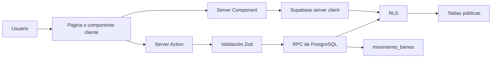

# Guía de código de SYSTEMACT

Esta guía está pensada para personas que clonan el proyecto por primera vez y
quieren entender cómo se mueve la información por la aplicación antes de cambiar
código. El detalle operativo de instalación vive en el `README.md`; este archivo
explica la intención de las piezas principales.

## Lectura rápida

SYSTEMACT es una app interna de inventario. Next.js renderiza la mayor parte de
las pantallas en el servidor, Supabase protege los datos con RLS y las reglas de
negocio sensibles viven en funciones RPC de PostgreSQL.

El patrón general es:



## Capas del proyecto

### `app/`

Contiene rutas de Next.js App Router.

- `app/(dashboard)/`: rutas protegidas para usuarios autenticados.
- `app/auth/`: rutas públicas de autenticación.
- `app/api/export/`: Route Handlers de solo lectura para descargar archivos
  Excel. Las mutaciones no van aquí; se hacen con Server Actions.

Las páginas son Server Components por defecto. Cuando una pantalla necesita
estado local, formularios, tablas interactivas o toasts, delega esa parte a un
componente con `"use client"`.

### `components/`

Agrupa componentes reutilizables:

- `components/ui/`: componentes shadcn/ui. Evita editarlos a mano salvo que sea
  un ajuste intencional del sistema de diseño.
- `components/layout/`: sidebar, navbar y navegación responsiva.
- formularios de autenticación y componentes compartidos de la portada.

### `lib/`

Es la capa de soporte de la app:

- `lib/supabase/`: creación de clientes Supabase para servidor, navegador y
  proxy de sesión.
- `lib/auth/require-rol.ts`: contexto de autenticación y guards por rol.
- `lib/validations/`: contratos Zod usados por formularios y Server Actions.
- `lib/export/excel.ts`: helpers para estilos y respuestas `.xlsx`.
- `lib/constants.ts`: roles, estados, motivos y navegación.

### `supabase/`

Define la base de datos reproducible:

- `migrations/00000000000000_initial_schema.sql`: fuente de verdad del esquema,
  RLS, funciones RPC y bucket de Storage.
- `migrations/_archive/`: historial de migraciones previas, conservado como
  referencia pero no ejecutado en el flujo actual.
- `seed.sql`: catálogos iniciales de sedes, áreas y tipos de bien.

## Flujo de lectura

Las pantallas que solo consultan datos siguen este recorrido:

1. La página en `app/(dashboard)/.../page.tsx` obtiene el contexto con
   `getAuthContext()` o valida rol con `requireRol()`.
2. La página crea un Supabase server client con `createClient()`.
3. Consulta tablas o vistas protegidas por RLS.
4. Pasa datos ya cargados a componentes hijos, normalmente tablas o formularios.

Este patrón evita `useEffect` para cargar datos iniciales y mantiene el estado
del servidor en Next.js.

## Flujo de mutación

Las escrituras siguen un contrato más estricto:

1. Un componente cliente arma `FormData` y llama una Server Action.
2. La Server Action obtiene el usuario con `getAuthContext()`.
3. La Server Action valida permisos de UI/backend temprano para dar feedback
   claro.
4. Zod valida y normaliza los datos recibidos desde `FormData`.
5. La Server Action llama un RPC de Supabase.
6. El RPC aplica la regla de negocio real, con RLS activa, transacción y
   auditoría cuando corresponde.
7. La Server Action ejecuta `revalidatePath()` para refrescar las pantallas
   afectadas.

Ejemplo conceptual:

```ts
const ctx = await getAuthContext();
if (!WRITE_ROLES.includes(ctx.rol)) {
  return { success: false, error: "No tienes permisos" };
}

const parsed = schema.safeParse(rawFormData);
if (!parsed.success) {
  return { success: false, error: parsed.error.issues[0]?.message };
}

const { error } = await supabase.rpc("crear_bien_con_auditoria", {
  p_usuario_responsable: ctx.userId,
  // resto de parámetros
});
```

## Autorización

La seguridad no depende de una sola capa:

- La UI oculta acciones según rol para que la experiencia sea clara.
- Los Server Components y Server Actions llaman `getAuthContext()` o
  `requireRol()`.
- Los RPCs llaman guards de PostgreSQL como `require_rol_escritura()` o
  `require_rol_admin()`.
- RLS permanece activa sobre las tablas públicas.

Si agregas un módulo que modifica datos, agrega validación de rol en la Server
Action y también dentro del RPC. La validación en React ayuda a la UX; la
validación en PostgreSQL protege el dato.

## Contratos de formularios

Cada formulario importante tiene dos esquemas Zod:

- Schema de cliente: espera valores ya tipados por React Hook Form.
- Schema de acción: espera strings de `FormData` y usa `z.coerce`.

Esto permite mensajes de error consistentes y evita confiar en datos enviados
desde el navegador.

## Auditoría

Las operaciones sobre bienes escriben en `movimiento_bienes`. El proyecto
prefiere hacerlo dentro de RPCs y no con triggers genéricos porque el texto de
auditoría necesita contexto de negocio, como nombres de sedes, áreas, motivos o
códigos generados.

## Exportaciones Excel

Los endpoints bajo `app/api/export/` son Route Handlers porque devuelven un
archivo descargable. Todos reutilizan `lib/export/excel.ts` para:

- metadata estándar del workbook;
- estilos de encabezado y totales;
- formato COP sin decimales;
- headers HTTP seguros para `.xlsx`.

## Cómo agregar una feature

1. Define o confirma el modelo de datos en la migración baseline.
2. Si modifica datos, crea un RPC con guard de rol y auditoría si aplica.
3. Agrega un schema Zod en `lib/validations/`.
4. Crea la Server Action en el módulo de `app/(dashboard)/`.
5. Crea la página como Server Component y delega interactividad a componentes
   cliente.
6. Usa constantes existentes para roles, estados y opciones.
7. Agrega pruebas unitarias para validaciones o helpers, y E2E si el flujo es
   crítico.
8. Actualiza este archivo, `README.md` o `supabase/README.md` si el cambio
   introduce una convención nueva.


## Archivos recomendados para empezar

- `app/(dashboard)/bienes/page.tsx`: lectura principal de inventario.
- `app/(dashboard)/bienes/actions.ts`: ejemplo de Server Actions con RPC.
- `app/(dashboard)/bienes/bien-form.tsx`: formulario cliente completo.
- `lib/auth/require-rol.ts`: contexto de autenticación.
- `lib/validations/bien.ts`: schemas de formulario y acción.
- `lib/export/excel.ts`: helpers compartidos de exportación.
- `supabase/migrations/00000000000000_initial_schema.sql`: modelo de datos y
  reglas reales de negocio.
